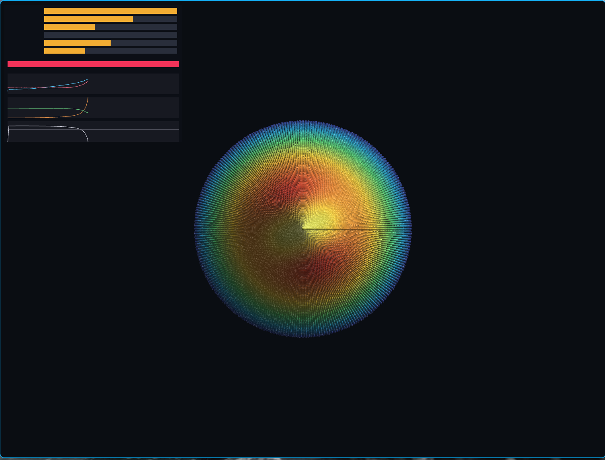

# plasma-stabilizer

A reinforcement-learning controller in C++ that stabilizes MHD instabilities in
a simulated tokamak. It contains a reduced-MHD plasma model, a synthetic
diagnostic chain, a rate-limited actuator set, a multi-objective reward, two
independent PPO implementations, and an OpenGL viewer that shows the plasma and
the controller's decisions side by side.

It is built on [particle-sim](../particle-sim), which supplies the `Simulation`
interface the viewer draws through, the math and timing core, and the entire
renderer. The physics here is grid-and-spectral rather than particle-based; what
carries over is the engine.



*A controlled discharge: nested helical flux surfaces, current drive on the
rational surface. The panel shows actuator positions, island width against the
disruption limit, and the diagnostic bands the controller is reading.*

---

## Build

Requires a C++20 compiler, CMake 3.20+, Ninja, and particle-sim cloned beside
this repository.

```sh
cmake -S . -B build -G Ninja -DCMAKE_BUILD_TYPE=Release
cmake --build build
ctest --test-dir build --output-on-failure
```

| Option | Default | Effect |
|---|---|---|
| `PLASMA_BUILD_VIEWER` | ON | OpenGL viewer (needs GL/X11/Wayland dev packages) |
| `PLASMA_WITH_RLTOOLS` | ON | Second training backend; fetches RLTools |
| `PLASMA_BUILD_TESTS` | ON | Physics, control and learner self-checks |
| `PLASMA_PARTICLE_SIM_DIR` | `../particle-sim` | Where the engine lives |

Headless (no GPU, no display, no RLTools fetch):

```sh
cmake -S . -B build -G Ninja -DPLASMA_BUILD_VIEWER=OFF -DPLASMA_WITH_RLTOOLS=OFF
```

## Run

```sh
./build/bin/plasma-train --updates 240              # train with the in-repo PPO
./build/bin/plasma-evaluate --policy policy.bin     # score it, measure latency
./build/bin/plasma-view --policy policy.bin         # watch it
./build/bin/plasma-train-rltools                    # train with RLTools instead
```

Viewer: left-drag orbits, scroll zooms, `space` pauses, `r` restarts,
`1`/`2`/`3` switch between the learned policy, the best fixed action, and no
control at all.

---

## The physics

### Reduced MHD

Strauss reduced MHD in a periodic cylinder, linearized about the equilibrium and
Fourier-decomposed as `exp(i(m*theta - n*zeta))`. Two fields per mode on a radial
grid:

```
d(psi)/dt = i F phi + eta Delta* psi - i n Omega psi
d(U)/dt   = [ i F Delta* psi - i (m/r) J0' psi ] / rho + nu Delta* U
            - i n Omega U + gamma_EP U
Delta* phi = U
```

`F(r) = m/q(r) - n` is the parallel wavenumber, zero on the rational surface
`q = m/n`. Two instabilities live in the same equations:

- **Tearing modes** have a rational surface inside the plasma. Field lines
  reconnect there at a rate set by the resistivity, fed by the equilibrium
  current gradient, and saturate as a magnetic island.
- **Alfvénic modes** have none, so `F` never vanishes and the same equations
  describe a shear Alfvén wave damped by continuum phase mixing. Energetic
  particles from the neutral beam drive it unstable.

Fields are complex because the phase is load-bearing: it carries plasma
rotation, mode locking, and the relative phase between an applied resonant field
and the island — which is one of the actuator channels.

Time integration splits the two timescales: RK4 on the ideal terms, whose
eigenvalues are bounded by `max|F| ~ 1`, and backward Euler on the diffusive
terms, whose explicit limit near the axis would be ~1e-3 Alfvén times because
`m^2/r^2` reaches 1e6 there. RK2 is not usable at all — the ideal spectrum is
purely imaginary and RK2's stability region excludes the imaginary axis.

### Equilibrium

The current profile is primary and everything else is derived from it:

```
J(r)     = ohmic + bootstrap + driven
psi0'(r) = (1/r) * integral_0^r J r' dr'
q(r)     = r / psi0'(r)
```

That direction is what makes the actuators mean something. Current drive
deposits current at a chosen radius, which reshapes `q`, which moves the
rational surfaces and changes the free energy available to the mode. Total
plasma current is held fixed, as an ohmic transformer would.

Islands feed back on the equilibrium, and the two effects pull opposite ways:

- flattening the **current** inside the island removes the gradient driving it —
  this is what makes the mode saturate;
- flattening the **pressure** removes the bootstrap current that gradient was
  carrying — this is what makes a neoclassical tearing mode self-sustaining.

They need different rules. Current flattens to the value that conserves the
enclosed current. Pressure follows the belt model: flat across the island at the
outer value, with the core dropped by the same amount. An earlier version
flattened both to the mean of the two edge values, which on a convex profile
sits *above* the curve — islands came out *increasing* stored energy.

### Validation

`tests/test_mhd.cpp` checks against known results rather than stored numbers:

| check | result |
|---|---|
| (2,1) tearing mode unstable in a tearing-unstable equilibrium | gamma = 0.019 /tau_A |
| growth rate independent of radial resolution | 0.01900 -> 0.01897 from 128 -> 1024 points |
| resistive scaling toward the gamma ~ eta^(3/5) exponent | slope -0.29 -> -0.53 as S goes 3e3 -> 3e5 |
| Alfvénic mode phase-mixes to one global frequency | omega = 0.286 at every radius |
| ...which sits at the continuum minimum | min\|F\| = 0.269, and the mode localizes there |
| beam drive has a threshold and saturates | damped at 0, unstable above ~0.13, bounded at 0.8 |
| current drive changes growth, and placement matters | -30% aimed at the surface; sign flips off it |
| applied resonant field drives or opposes by phase | aligned grows, opposed shrinks |

The resistive-scaling exponent is the strongest single piece of evidence:
gamma ~ eta^(3/5) is the textbook tearing result, it is only approached
asymptotically, and the measured slope steepens monotonically toward -0.6 with
rising Lundquist number.

---

## The control problem

### Diagnostics

The controller never sees mode amplitudes. It sees what a tokamak control system
sees: eight Mirnov coils around the wall, eight ECE channels, a line-integrated
density, all with noise. Every instability signal it has is inferred from those.

The two instabilities are separated the way a real machine separates them — in
frequency, on the same coil. The island rotates with the plasma at ~0.03
rad/tau_A; the Alfvénic mode rings near the continuum an order of magnitude
faster. A low-pass and a high-pass at 0.12 rad/tau_A split them, and running RMS
and log-derivative estimators turn each band into an amplitude and a growth rate.

Every filter is fixed-state and O(1) per sample. That is a requirement, not an
optimization: an operator whose cost grows with discharge length is disqualified
from a real control loop before it starts.

### Actuators

Six channels, all rate-limited. Without slew limits a policy learns bang-bang
control no hardware could execute, and "actuator smoothness" stops being
measurable because every command is already a step.

| channel | effect |
|---|---|
| current-drive power | up to 6% of plasma current, deposited locally |
| current-drive radius | where, r/a in [0.42, 0.95] |
| beam power | heats the plasma **and** drives the Alfvénic mode |
| resonant field amplitude | applied helical field at the wall |
| resonant field phase | aligned with the island it drives it, opposed it cancels |
| gas puff | raises density, cools the plasma, raises resistivity |

### Reward

Six objectives, and they genuinely fight:

```
+ confinement    stored energy relative to the reference discharge
- tearing        island width, normalized to the disruption threshold
- alfvenic       mode amplitude relative to the fast-ion saturation level
- smoothness     mean squared actuator motion this step
- chatter        running variance of actuator positions
- saturation     fraction of channels pinned at a limit
+ survival       per step completed
- disruption     per step the discharge failed to survive to
```

Confinement wants the beam high; Alfvénic stability wants it low. Tearing
stability wants current drive on the island, but current drive reshapes `q`,
which moves the island. Smoothness wants none of it to move.

Two terms are shaped the way they are because training exploited the earlier
version:

- **Chatter is measured on actuator positions, not commanded actions.** During
  training the command carries the policy's exploration noise, and charging the
  policy for exploring teaches it not to.
- **The disruption penalty scales with the steps the discharge did not reach.**
  With a flat penalty, once the running reward went negative the cheapest move
  was to end the episode — and the policy learned exactly that, driving the beam
  up for confinement and disrupting at a third of the pulse length on purpose.
  `tests/test_control.cpp` now asserts the penalty exceeds the worst per-step
  score a surviving discharge can have.

### Timescales

One Alfvén time maps to 0.38 ms, chosen so the simulated tearing growth time
lands in the tens of milliseconds where real tearing modes grow. The control
period is 2.5 tau_A — a 0.95 ms loop, about 1 kHz, which is what a real
neoclassical-tearing-mode controller runs at. An episode is 400 steps, a 380 ms
pulse.

---

## Reinforcement learning

Two independent learners on the same environment:

**In-repo PPO** (`src/plasma/rl/`) — dense network, hand-written gradients,
Adam, GAE, clipped surrogate, observation and value normalization. Written out
rather than pulled in because the whole model is three layers of a few thousand
weights.

**RLTools** (`apps/train_rltools.cpp`) — the same environment behind an adapter
to [RLTools](https://github.com/rl-tools/rl-tools)' statically-dispatched
interface, trained by its PPO. The point is not throughput. An environment and a
learner written by the same person can agree with each other and both be wrong;
a second implementation by someone else is the check.

The adapter works around one structural mismatch: RLTools copies `State` values
freely, so a heavyweight simulation cannot live there. `State` is a lightweight
cursor and the simulation lives in the environment object, one per parallel
worker — consistent because the on-policy runner only ever steps an environment
forward from the state it last produced.

The learner is validated independently of the plasma (`tests/test_rl.cpp`):
backpropagation checked against finite differences on every parameter, the
network fits a smooth function through its own gradients, and PPO recovers the
optimum of a continuous bandit.

### What training actually showed

The honest result is that **this environment is a hard exploration problem, and
diagnosing why was most of the work.** Three findings, in order:

1. **The critic could not learn.** Episode returns reach several hundred and a
   freshly initialized value network cannot predict that; explained variance sat
   at -50. Standardizing the critic's targets against a running return scale
   fixed it — explained variance 0.97 within five updates.

2. **The reward rewarded disrupting.** Described above. The largest single
   error, and invisible until the learning curve was read next to the episode
   lengths.

3. **Slew-limited actuators low-pass exploration noise.** The good band of
   deposition radii is about 0.15 wide in r/a. IID Gaussian noise on the
   *command* becomes a much smaller excursion on the *actuator*, so the mirror
   hovered near its starting point and the policy never experienced correct
   aiming — no experience, no gradient. Widening exploration made it worse,
   because it smeared the aiming signal instead.

The landscape underneath was also genuinely bimodal: aiming at r/a = 0.23 and at
r/a = 0.68 both return about +345, and everything between disrupts. Those are two
real and distinct mechanisms — global `q` reshaping versus local island
suppression. Restricting the launcher's steering range to the outer plasma, a
real geometric constraint, removes the inner branch and leaves a unimodal
landscape a policy gradient can climb:

| deposition radius (r/a) | 0.42 | 0.53 | 0.63 | 0.69 | 0.74 | 0.79 | 0.90 |
|---|---:|---:|---:|---:|---:|---:|---:|
| return | -7 | +7 | +165 | **+328** | +314 | +174 | +121 |
| disruption rate | 1.00 | 1.00 | 0.75 | 0.00 | 0.00 | 0.88 | 1.00 |

---

## Results

This machine, 16 threads, Release, under background load — treat timings as a
floor.

### Throughput

```
10,500 simulated control episodes per hour, single-threaded
```

Each episode is 400 control steps of reduced MHD with three modes on a 192-point
radial grid. The requirement was 100+ per hour.

### Control latency

`plasma-evaluate` times exactly what a deployed controller runs — observation
packing, normalization, forward pass — over every decision in the run. Measured
over 2357 decisions:

```
median 18.8 us, p99 51.3 us, worst 167.8 us
```

The control period is 950 us, so the worst decision uses 18% of the budget it
actually has, and 0.34% of a 50 ms allowance. The margin comes from the model
being small on purpose: 14,413 parameters across a 43-input, two-layer network.

### Controller performance

```sh
./build/bin/plasma-evaluate --policy policy.bin --episodes 40
```

| controller | return | disruptions | mean island | confinement |
|---|---:|---:|---:|---:|
| passive (full beam, no current drive) | -579 | 60% | 0.430 | 1.39 |
| best constant action | +322 | 0% | 0.014 | 0.76 |
| learned policy | see evaluation output | | | |

The "best constant action" bar is deliberately hard: current drive parked on the
rational surface with the beam just below the Alfvénic threshold, found by
sweeping the action space. Beating it requires reacting to the plasma rather than
settling on a good average — the rational surface moves with the per-episode
equilibrium randomization, so a fixed aim is never optimal for long.

---

## Layout

```
src/plasma/
  core/         Real and Complex types; double precision, deliberately
  mhd/          RadialGrid, Equilibrium, ReducedMhd
  diagnostics/  streaming filters, synthetic Mirnov / ECE / interferometer
  control/      Actuators, reward, TokamakEnv
  rl/           Mlp, Ppo, RLTools adapter
  render/       TokamakScene (a psim::Simulation), ControlOverlay
apps/           train, evaluate, view, train_rltools
```

Dependencies point one way: `render -> rl -> control -> diagnostics -> mhd ->
core`. A training run links no GL and opens no window.

## Tests

```sh
ctest --test-dir build --output-on-failure
```

| suite | what it pins |
|---|---|
| `test_radial_grid` | flux-form Laplacian exact on the vacuum solution; apply/solve round-trip; implicit diffusion |
| `test_equilibrium` | analytic q profile, rational surfaces, current drive local and I_p-conserving, islands cost confinement |
| `test_mhd` | tearing growth and its resistive scaling, Alfvén continuum, actuator authority |
| `test_control` | slew limits, band separation, growth-rate recovery, determinism, disrupting is never worth it |
| `test_rl` | backprop against finite differences, function fitting, normalizer, PPO on a bandit, checkpoint round-trip |
